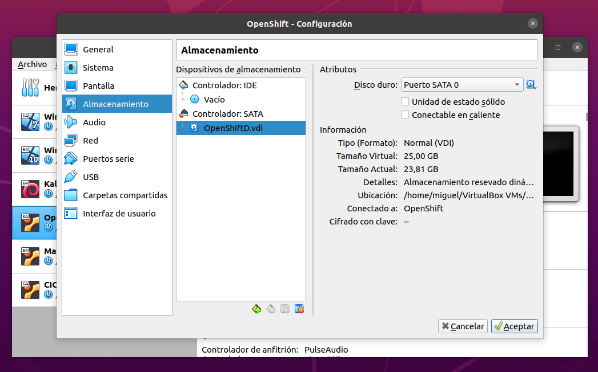
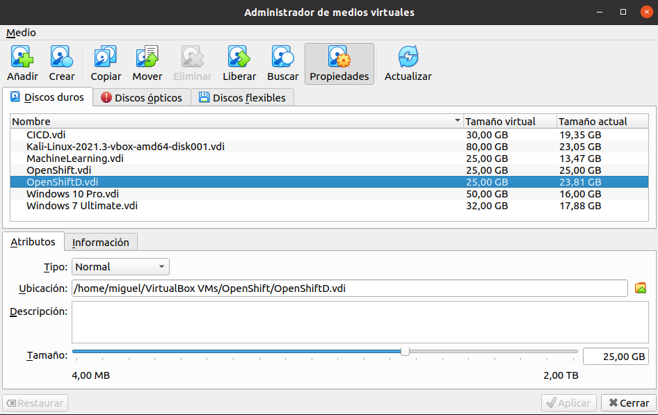
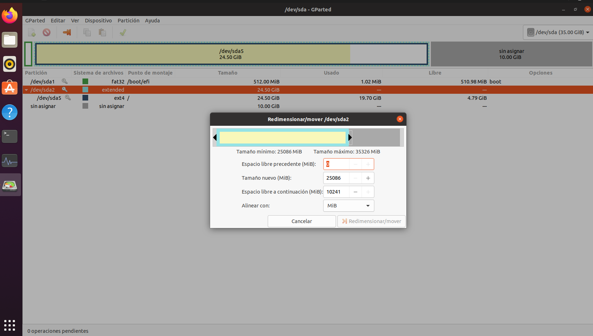
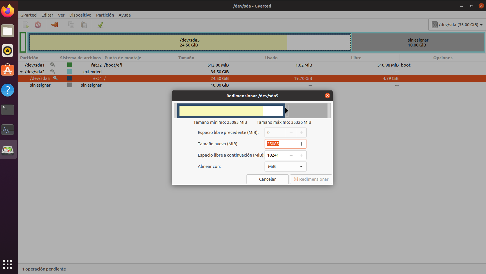
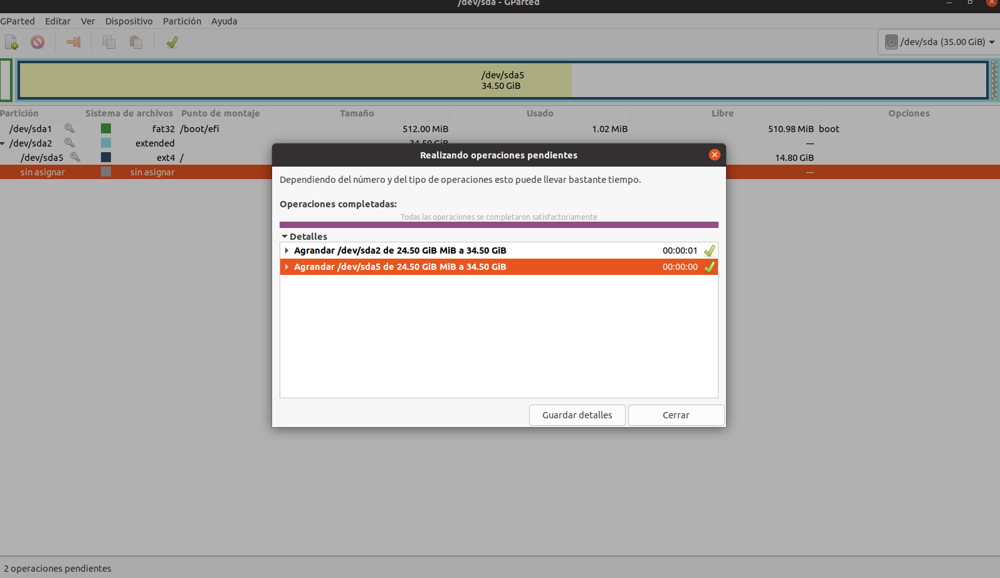
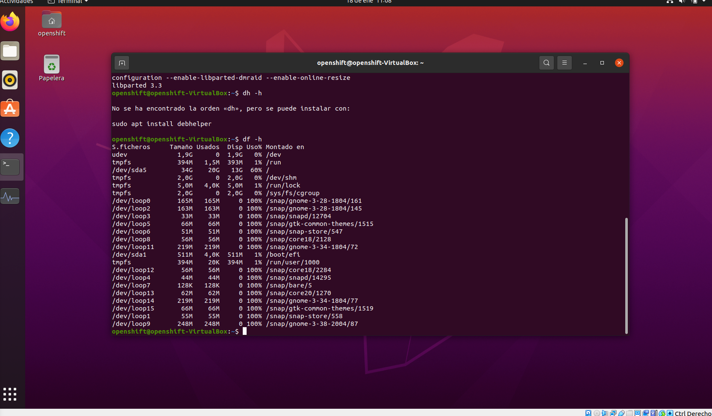

# Description
Some VirtualBox Tutorials

# Convert Between Fixed and Dynamic Disks
If we want to resize our virtualbox we must to set our disk like dynamic, so if our disk its in a fix mode we could convert it.

- Exexute this command to create a clone version of our old disk but in dynamic mode

```shell
VBoxManage.exe clonemedium disk "C:\path\to\source.vdi" "C:\path\to\destination.vdi" –variant Standard
```

- Now we must detach out old disk ans attache the new on from virtualbox.



# Resize a Dynamic Disk

One prerequisite to resize any disk in VirtualBox it's that it must be in dynamic mode. 

-Now from v5 of Virtualbox exist a tool called Virtual Media Manager to resize the disk in a visual mode



- The VistualBox it's resize but not the partition, so we must ran the image and rezise. We recomend use the tool called gparted if not exist installed:

```shell
sudo apt-get install gparted
```

- Resize the extended partition to the maximun offered by the VirtualBox disk



- Resize the partition to the maximun offered by the extended parition disk. Appli all changes before close.





- check the new size.

Execute this command

```shell
df -h
```

